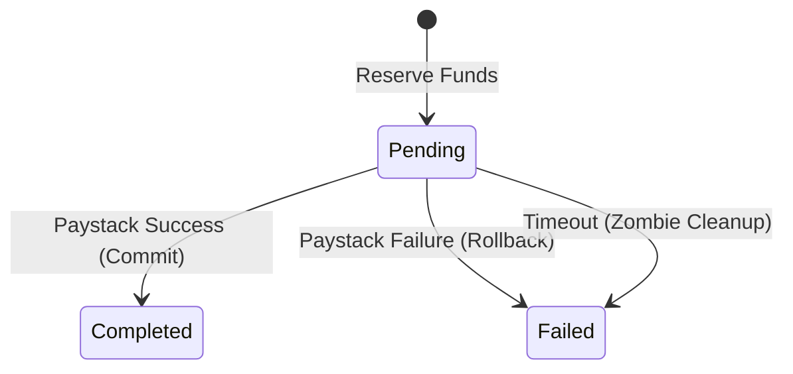

# Architecture

## Executive Summary

Stipends uses a modern serverless stack (Next.js 15, Neon Postgres, Clerk Auth) optimized for rapid development and scalability. The architecture prioritizes mobile performance (PWA with Serwist), security (encryption, 2FA, audit logs), and fintech compliance (escrow state machine, immutable transaction logs). Key integrations include Paystack for payment collection and transfers (7-day escrow) and Inngest for scheduled tasks (auto-release, reminders).

## Project Initialization

First implementation story should execute:

```bash
npx create-next-app@latest perks-app --typescript --tailwind --eslint --app --src-dir --import-alias "@/*"
npm install @serwist/next @serwist/precaching @serwist/sw
```

This establishes the base architecture with these decisions:
- **Framework**: Next.js 15 (App Router)
- **Language**: TypeScript
- **Styling**: Tailwind CSS
- **PWA Engine**: Serwist
- **Linting**: ESLint

## Decision Summary

| Category | Decision | Version | Affects Epics | Rationale |
| -------- | -------- | ------- | ------------- | --------- |

| Core Stack | Database | v16 (Postgres) | - | Neon (Serverless Postgres) + Drizzle ORM |
| Core Stack | Authentication | Latest | - | Clerk (B2B Organizations for Employer management) |
| Core Stack | Payments | Latest | - | Paystack (Collections + Transfers for Escrow) |
| Core Stack | State Management | Latest | - | TanStack Query (Server) + React Context (UI) |
| Core Stack | Email | Latest | - | Resend + React Email |
| Core Stack | Scheduling | Latest | - | Inngest (Serverless Queues & Cron) |

## Project Structure

```
perks-app/
├── src/
│   ├── app/                 # Next.js App Router
│   │   ├── (auth)/          # Authentication routes
│   │   ├── (dashboard)/     # Protected dashboard routes
│   │   │   ├── employer/    # Employer-specific views
│   │   │   ├── employee/    # Employee-specific views
│   │   │   └── merchant/    # Merchant-specific views
│   │   ├── api/             # API Routes (Webhooks, etc.)
│   │   └── layout.tsx       # Root layout
│   ├── components/          # React components
│   │   ├── ui/              # Reusable UI atoms (Button, Input)
│   │   ├── modules/         # Feature-specific components
│   │   └── emails/          # React Email templates
│   ├── db/                  # Database configuration
│   │   ├── schema.ts        # Drizzle schema definitions
│   │   └── index.ts         # DB connection
│   ├── lib/                 # Shared utilities
│   │   ├── utils.ts         # Helper functions
│   │   ├── validators/      # Zod schemas
│   │   └── constants.ts     # Global constants
│   ├── server/              # Server-side logic
│   │   ├── actions/         # Server Actions
│   │   └── procedures/      # Reusable business logic
│   ├── styles/              # Global styles
│   └── types/               # TypeScript type definitions
├── public/                  # Static assets
├── drizzle.config.ts        # Drizzle configuration
├── next.config.ts           # Next.js configuration
├── tailwind.config.ts       # Tailwind configuration
└── package.json             # Dependencies
```

## Epic to Architecture Mapping

| Epic | Primary Components | Data Models |
| ---- | ------------------ | ----------- |
| **User Accounts** | Clerk Auth, `(auth)` routes | `users`, `organizations` |
| **Marketplace** | `(dashboard)/employee/marketplace`, `modules/marketplace` | `merchants`, `deals`, `categories` |
| **Escrow** | Paystack API, `server/actions/payments` | `transactions`, `escrow_holds` |
| **Employee Portal** | `(dashboard)/employee`, `modules/wallet` | `wallets`, `transactions` |
| **Employer Dashboard** | `(dashboard)/employer`, `modules/analytics` | `organizations`, `employees` |
| **Email Marketing** | Resend API, `components/emails` | `email_logs`, `campaigns` |
| **Tax Compliance** | `server/procedures/tax`, `modules/reports` | `tax_reports`, `rent_receipts` |

## Technology Stack Details

### Core Technologies

- **Framework**: Next.js 15 (App Router)
- **Language**: TypeScript 5.x
- **Styling**: Tailwind CSS 4.x (via starter)
- **Database**: Neon (PostgreSQL 16)
- **ORM**: Drizzle ORM
- **Auth**: Clerk
- **Payments**: Paystack
- **Job Queue**: Inngest

### Integration Points

- **Paystack**: Webhooks handled at `/api/webhooks/paystack` to update transaction status.
- **Clerk**: Webhooks handled at `/api/webhooks/clerk` to sync user data to our DB.
- **Resend**: Called via Server Actions for transactional emails.
- **Inngest**: Functions defined in `/src/inngest` for scheduled tasks (e.g., escrow release).

## Implementation Patterns

These patterns ensure consistent implementation across all AI agents:

### 1. Server Actions for Mutations
All data mutations (creates, updates, deletes) MUST use Next.js Server Actions.
- **Pattern**: Define actions in `src/server/actions`.
- **Validation**: Use Zod to validate all inputs.
- **Error Handling**: Return a standardized `ActionResponse` type `{ success: boolean, data?: T, error?: string }`.

### 2. TanStack Query for Data Fetching
Client-side data fetching (e.g., live wallet balance) MUST use TanStack Query.
- **Pattern**: Create custom hooks in `src/hooks/queries`.
- **Keys**: Use a `queryKeys` factory object to maintain consistency.

### 3. Component Composition
Follow the Atomic Design principle adapted for React.
- **UI**: Generic, reusable components (buttons, inputs) in `src/components/ui`.
- **Modules**: Business-logic-aware components (e.g., `DealCard`, `WalletWidget`) in `src/components/modules`.

## Consistency Rules

### Naming Conventions

- **Files**: `kebab-case.ts` (e.g., `user-profile.tsx`, `utils.ts`)
- **Components**: `PascalCase` (e.g., `UserProfile`)
- **Functions/Variables**: `camelCase` (e.g., `getUserProfile`, `isLoading`)
- **Database Tables**: `snake_case` (e.g., `user_profiles`, `created_at`)
- **Environment Variables**: `UPPER_SNAKE_CASE` (e.g., `NEXT_PUBLIC_API_URL`)

### Code Organization

- **Colocation**: Keep related files close. If a component needs a specific helper, put it in the same folder or a `utils` file nearby.
- **Barrel Files**: Use `index.ts` for clean exports from directories (e.g., `export * from './button'`).

### Error Handling

- **UI**: Use `sonner` (or similar) for toast notifications.
- **Server**: Throw specific errors (e.g., `AuthenticationError`, `NotFoundError`) that are caught by the Server Action wrapper.
- **Global**: Use `error.tsx` boundaries in Next.js App Router.

### Logging Strategy

- **Development**: Console logs are acceptable.
- **Production**: Use a structured logger (e.g., `pino`) to capture context (userId, requestId).
- **Sensitive Data**: NEVER log PII or secrets.

## Data Architecture

### Key Models

- **User**: Synced from Clerk. Links to `Employee` or `Employer` profile.
- **Organization**: Represents an Employer.
- **Wallet**: Stores stipend balance. Linked to `Employee`.
- **Transaction**: Records all money movement. Types: `DEPOSIT`, `SPEND`, `REFUND`.
- **Deal**: Offer from a Merchant.
- **EscrowHold**: Tracks funds held for a transaction. Statuses: `HELD`, `RELEASED`, `DISPUTED`.

## API Contracts

- **Internal**: Server Actions (Typed directly via TypeScript).
- **External (Webhooks)**:
    - `POST /api/webhooks/paystack`: Verifies signature, handles `charge.success`.
    - `POST /api/webhooks/clerk`: Verifies signature, handles `user.created`.

## Security Architecture

- **Authentication**: Clerk handles identity.
- **Authorization**: Middleware (`middleware.ts`) protects routes. RLS-like logic in Server Actions checks `orgId`.
- **Data Protection**: All inputs validated with Zod. Secrets stored in `.env.local` (not committed).

## Performance Considerations

- **Images**: Use `next/image` for all assets.
- **Fonts**: Use `next/font` for Google Fonts (Outfit, Inter).
- **Caching**: Leverage Next.js Request Memoization and Data Cache where appropriate.
- **PWA**: Service Worker caches static assets for offline shell.

## Deployment Architecture

- **Platform**: Vercel (recommended for Next.js).
- **Database**: Neon (Serverless).
- **Cron**: Inngest (triggered via HTTP).

## Development Environment

### Prerequisites

- Node.js 18+
- npm or pnpm
- Git

### Setup Commands

```bash
# Install dependencies
npm install

# Set up environment variables
cp .env.example .env.local

# Push database schema
npx drizzle-kit push

# Run development server
npm run dev
```

## Architecture Decision Records (ADRs)

1.  **ADR-001: Next.js 15 Starter**: Chosen for stability and PWA support via Serwist.
2.  **ADR-002: Clerk + Neon**: Chosen for speed of implementation (B2B features) and serverless scalability.
3.  **ADR-003: Paystack Collections + Transfers**: Chosen to enable 7-day escrow holds. Collections gather 100% of payment into Platform Balance, then Transfers release funds to merchants after escrow period. Split Payments were unsuitable (T+1 settlement).
4.  **ADR-004: Inngest**: Chosen for reliable serverless scheduling (escrow release) without infrastructure management.

---

_For: Adam_

## Split Payment Architecture (Story 5.4)

To support purchases exceeding wallet balance (split between Wallet + Card), we use a **Reservation Pattern** to ensure atomicity.

### Flow
1.  **Reserve**: Create `transaction` (Type: DEBIT, Status: PENDING) for the wallet portion.
2.  **Charge**: Call Paystack for the remaining balance.
3.  **Commit**: If Charge succeeds, update `transaction` status to COMPLETED.
4.  **Rollback**: If Charge fails, update `transaction` status to FAILED (releasing the logical hold).

### State Machine



## Architecture Decision Records (ADRs)

1.  **ADR-001: Next.js 15 Starter**: Chosen for stability and PWA support via Serwist.
2.  **ADR-002: Clerk + Neon**: Chosen for speed of implementation (B2B features) and serverless scalability.
3.  **ADR-003: Paystack Collections + Transfers**: Chosen to enable 7-day escrow holds. Collections gather 100% of payment into Platform Balance, then Transfers release funds to merchants after escrow period. Split Payments were unsuitable (T+1 settlement).
4.  **ADR-004: Inngest**: Chosen for reliable serverless scheduling (escrow release) without infrastructure management.
5.  **ADR-005: Split Payment Atomicity**: Chosen **Reservation Pattern** over 2PC. Since Paystack (Card) is the external authority, local Wallet operations are "optimistically reserved" and rolled back if the external authoritative charge fails.
