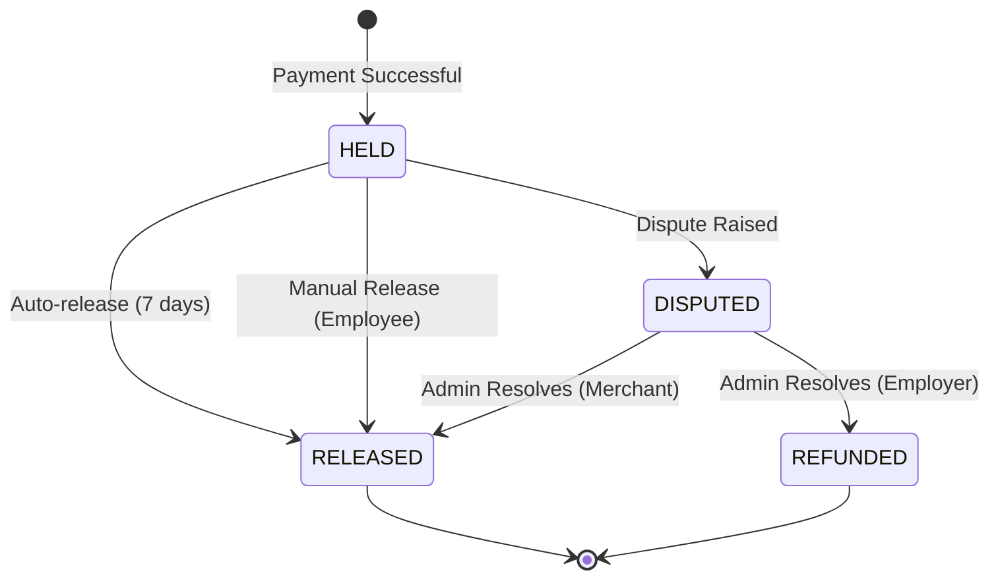

# Epic 3 Prep Sprint - Technical Spike

**Date:** 2025-11-26 (Day 2)  
**Owners:** Charlie (Senior Dev), Alice (Product Owner)  
**Goal:** Research and prepare all technical dependencies for Epic 3 (Escrow & Payments)

---

## Table of Contents

1. [Paystack Split Payments](#1-paystack-split-payments)
2. [Inngest Cron Jobs](#2-inngest-cron-jobs)
3. [Escrow State Machine](#3-escrow-state-machine)
4. [Nigerian Payment Compliance](#4-nigerian-payment-compliance)
5. [Deployment Process](#5-deployment-process)
6. [Readiness Checklist](#6-readiness-checklist)

---

## 1. Paystack Integration (Pivoted to Transfers)

**Status:** 🔄 Pivoted from Split Payments

### Overview
To support 7-day escrow, we must collect funds first and transfer later. We cannot use Split Payments (which settle T+1).

### New Architecture: Transfers
1.  **Collection:** Accept payment (100%) from user. Funds stay in Platform Balance.
2.  **Onboarding:** Create a **Transfer Recipient** for the merchant.
3.  **Settlement:** After 7 days, trigger a **Transfer** to the recipient.

### API Endpoints (Hypothesis)

1.  **Create Transfer Recipient:**
    -   Endpoint: `POST /transferrecipient`
    -   Body:
        ```json
        {
          "type": "nuban",
          "name": "Merchant Name",
          "account_number": "0123456789",
          "bank_code": "044",
          "currency": "NGN"
        }
        ```
    -   *Returns:* `recipient_code` (e.g., `RCP_xxxx`) - Store this in `merchants` table.

2.  **Initiate Transfer (Release Funds):**
    -   Endpoint: `POST /transfer`
    -   Body:
        ```json
        {
          "source": "balance",
          "amount": "475000", // 95% of 500k
          "recipient": "RCP_xxxx",
          "reason": "Order #123 Settlement"
        }
        ```

### Action Items
- [ ] Verify `POST /transferrecipient` payload
- [ ] Verify `POST /transfer` payload
- [ ] **Critical:** Ensure Paystack account has "Transfers" enabled (requires ID verification).

---

## 2. Inngest Cron Jobs

**Status:** ✅ Researched

### Overview
Used for auto-releasing funds from escrow after 7 days if no dispute is raised.

### Configuration
We use `inngest.createFunction` with a cron trigger.

**Example Code:**
```typescript
import { inngest } from "@/inngest/client";

export const autoReleaseEscrow = inngest.createFunction(
  { id: "auto-release-escrow" },
  { cron: "0 0 * * *" }, // Run every day at midnight
  async ({ step }) => {
    await step.run("check-expired-escrows", async () => {
      // Logic to find and release expired escrows
      // 1. Query DB for escrows in HELD state created > 7 days ago
      // 2. Loop through and release them
    });
  }
);
```

### Local Testing
- Use Inngest Dev Server (`npx inngest-cli@latest dev`)
- Trigger cron manually via Dev Server UI


---

## 3. Escrow State Machine

**Status:** ✅ Designed

### States
- **HELD:** Funds secured, waiting for fulfillment or timeout. (Initial State)
- **RELEASED:** Funds transferred to merchant. (Final State)
- **DISPUTED:** Transaction flagged by employee. Auto-release paused.
- **REFUNDED:** Funds returned to employer. (Final State)

### Transitions

| From | To | Trigger | Condition |
|------|----|---------|-----------|
| `HELD` | `RELEASED` | **Auto-Release** | `createdAt` > 7 days AND no dispute |
| `HELD` | `RELEASED` | **Manual Release** | Employee confirms receipt |
| `HELD` | `DISPUTED` | **Raise Dispute** | Employee actions within 7 days |
| `DISPUTED` | `RELEASED` | **Resolve (Merchant)** | Admin rules in favor of merchant |
| `DISPUTED` | `REFUNDED` | **Resolve (Employer)** | Admin rules in favor of employer |

### Diagram



### Edge Cases
- **Dispute on Day 6.9:** Must pause auto-release timer.
- **Double Release:** Race condition between auto-release and manual release. *Mitigation: Database transaction + status check.*
- **Transfer Failures:** Paystack transfer fails during release. *Mitigation: Retry mechanism (Inngest).*


---

## 4. Nigerian Payment Compliance

**Status:** ⚠️ Risks Identified

### Escrow Model Analysis
To implement a 7-day escrow, we have two technical options with different compliance implications:

#### Option A: Split Payments (Original Plan)
- **Flow:** Customer pays -> Split to Merchant (95%) + Platform (5%) immediately.
- **Settlement:** Paystack settles to Merchant T+1.
- **Problem:** We **cannot** hold funds for 7 days. Merchant gets paid before delivery confirmed.
- **Verdict:** ❌ **Unsuitable for Escrow.**

#### Option B: Collections + Transfers (Recommended)
- **Flow:** Customer pays 100% -> Platform Paystack Balance.
- **Hold:** Funds sit in our Paystack Balance (HELD state).
- **Release:** After 7 days, we trigger a **Transfer** to Merchant's bank account.
- **Compliance Risk:** We are holding funds.
- **Mitigation:**
    - We are acting as a "Commercial Agent" authorized by the merchant to collect funds.
    - Funds are in Paystack (licensed PSSP), not our personal bank account.
    - **Requirement:** We need to verify if our Paystack account type supports "Transfers" (requires business verification).

### Regulatory Checklist (CBN)
- [ ] **KYC:** We must verify merchants (CAC documents, Directors). *Already part of onboarding.*
- [ ] **Data Retention:** Keep transaction logs for 7 years.
- [ ] **Dispute Resolution:** Must have a clear refund policy.
- [ ] **Licensing:** As an aggregator/marketplace, we likely fall under "PSS" (Payment Solution Service) regulation, but using Paystack covers the heavy lifting.

### Action Item
- **Pivot Technical Approach:** Switch from "Split Payments" to "Transfers" for the Merchant share.
- **Verify:** Check Paystack Dashboard for "Transfers" eligibility.


---

## 5. Deployment Process

**Status:** ✅ Documented

See [README.md](../README.md#deployment) for full deployment instructions, including:
- Vercel setup
- Environment variables
- Database migrations
- Manual deployment commands

---

## 6. Readiness Checklist

- [x] **Testing Infrastructure:** Ready (Day 1) ✅
- [x] **Inngest Integration:** Researched & Documented ✅
- [x] **Escrow Design:** State Machine & Diagram Complete ✅
- [x] **Compliance:** Risks Identified & Mitigated (Pivot to Transfers) ✅
- [ ] **Paystack Account:** Needs "Transfers" enabled (Manual Step) ⚠️
- [ ] **API Verification:** Need to verify Transfer endpoints with test account ⚠️

**Conclusion:** We are ready to start Epic 3, but **Story 3.2 (Paystack Integration)** must start with a verification step for the Transfers API.

---

## 7. Architectural Review (Winston)

**Status:** ✅ Approved

### Analysis
The pivot from "Split Payments" to "Collections + Transfers" is **architecturally sound and necessary**.
-   **Validation:** Split payments (T+1 settlement) fundamentally violate the 7-day escrow requirement.
-   **Trust Model:** Shift from Trustless (Paystack splits) to Trusted (Platform holds). This is acceptable but requires strict state management.

### Critical Requirements
1.  **Reconciliation:** We must implement a daily reconciliation job to ensure:
    -   `SUM(Escrow HELD)` == `Paystack Balance` - `Unsettled Fees`.
    -   *Action:* Added to Story 3.5 (Inngest).
2.  **Refunds:** The state machine has a `REFUNDED` state.
    -   *Implementation:* Use Paystack Refund API (`POST /refund`) for disputes resolved in Employer's favor.
3.  **Idempotency:** All Transfer and Refund calls **must** use unique idempotency keys (e.g., `order_id` or `escrow_id`) to prevent double-spending.

**Verdict:** Proceed with "Collections + Transfers" architecture.

